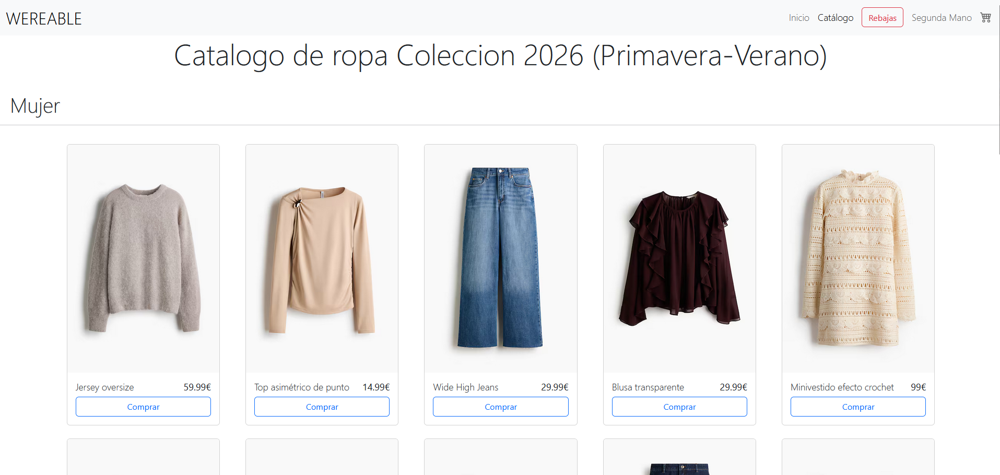
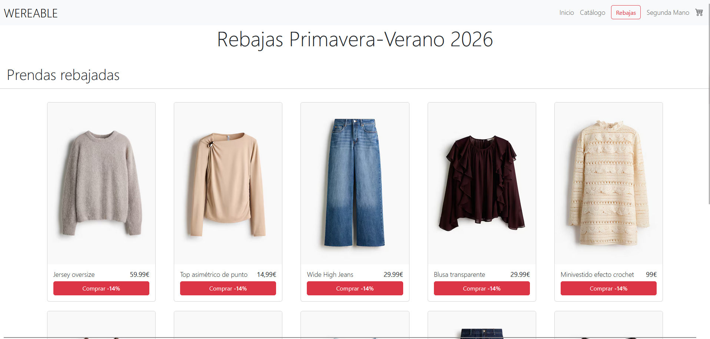
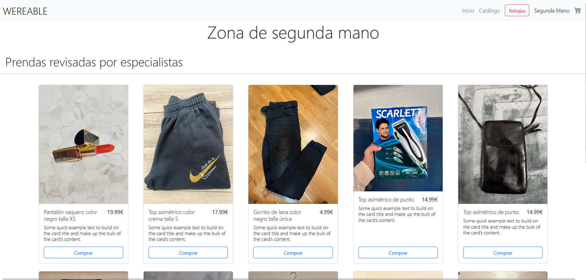
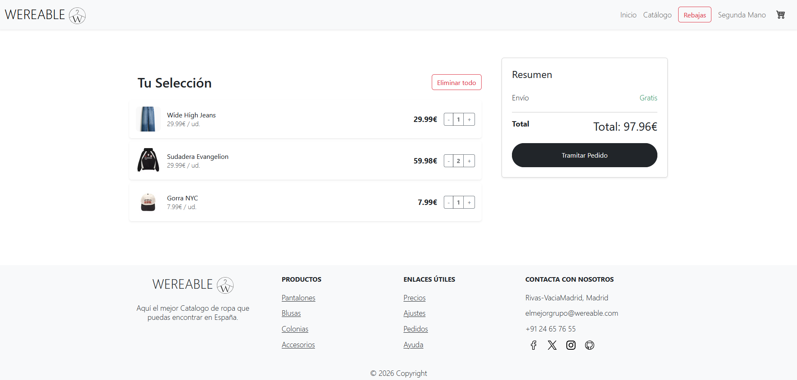

# ✨ WEREABLE — Proyecto Final Diseño Web

## 🛍️ Sobre el proyecto
**WEREABLE** es una tienda online de moda desarrollada como proyecto final de Diseño Web.  
Simula una experiencia real de e-commerce con un diseño moderno, limpio y centrado en la usuaria.

El objetivo principal es aplicar conocimientos de **maquetación web, diseño visual y navegación intuitiva**, creando una web funcional y responsive.

---

## 🎯 Objetivos
- Crear una interfaz moderna y atractiva
- Simular el funcionamiento de una tienda online real
- Aplicar buenas prácticas de diseño web
- Mejorar la experiencia de navegación del usuario
- Adaptar la web a distintos dispositivos (responsive)

---

## 🧩 Estructura del proyecto

La web está organizada en diferentes secciones que representan el flujo típico de compra online:

### 🏠 Página principal — `index.html`
- Presentación de la marca WEREABLE
- Imagen visual principal y navegación
- Acceso rápido a las categorías

**Función:** introducir al usuario y guiar la navegación.

---

### 👗 Catálogo — `catalog.html`
- Listado de productos disponibles
- Diseño tipo tienda online
- Visualización clara de prendas

**Función:** permitir explorar productos y simular la experiencia de compra.

---

### 🔥 Rebajas — `sales.html`
- Productos destacados con descuentos
- Sección enfocada en promociones

**Función:** destacar ofertas y mejorar la experiencia comercial.

---

### ♻️ Segunda mano — `secondhand.html`
- Catálogo de ropa reutilizada
- Enfoque sostenible dentro de la tienda

**Función:** añadir variedad y un concepto ecológico al e-commerce.

---

### 🛒 Carrito — `carrito.html`
- Simulación del carrito de compra
- Visualización de productos seleccionados

**Función:** representar el proceso final antes de la compra.

---

## 💻 Tecnologías utilizadas
- HTML5
- CSS3
- JavaScript
- Diseño Responsive
- Maquetación web moderna

---

## 🎨 Diseño y experiencia
El proyecto prioriza:
- ✨ Estética limpia y moderna
- 📱 Adaptabilidad a distintos dispositivos
- 🧭 Navegación intuitiva
- 🛍️ Experiencia realista de e-commerce

---

## 📁 Estructura de carpetas
📦 Proyecto-Final-Diseno
- ┣ 📂 css
- ┣ 📂 js
- ┣ 📂 img
- ┣ 📂 assets
- ┣ 📄 index.html
- ┣ 📄 catalog.html
- ┣ 📄 sales.html
- ┣ 📄 secondhand.html
- ┗ 📄 carrito.html

---

## 👩‍💻 Autores
- Proyecto desarrollado por **Nuria Pinés, Javier Pinel, Marcos Gilson, Marco Martínez** como trabajo final de Diseño Web.
- Este trabajo se tiene que ejecutar desde servidor, **open with live server**.
---

✨ *WEREABLE combina diseño visual y funcionalidad para recrear una experiencia real de compra online.*
